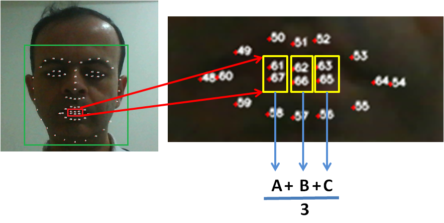

# Speaker detection by watching lip movements
A simple RNN based detector that determines whether someone is speaking by watching their lip movements for 1 second of video (i.e. a sequence of 25 video frames). The detector can be run in real time on a video file, or on the output of a webcam by using a sliding window technique. See below for details.

**The RNN's detection algorithm is as follows:**
1. Accept a sequence of 25 frames (i.e. 1 second's worth of frames of a 25 fps video), from the input video file or webcam. The sequence length is configurable.
2. For each video frame in this sequence:
   1. Convert it to a gray frame. This speeds up the next few steps (less number of pixels to process). 
   2. Detect the face in the frame using some face detector. I have used the HOG based detector from [dlib](http://dlib.net/). You can replace it with a detector of your choice.
   3. Feed the detector's bounding box to a facial landmarks predictor. I have used the shape predictor that comes with dlib.
   4. From the landmark predictor, fetch the points that mark the inner edges of the top and bottom lip. In case of the dlib predictor, these are part numbers 61, 62, 63 for the top lip, and 67, 66, 65 on the bottom lip. See Figure 1 below.
   5. Calculate the average pixel separation between part pairs 61 & 67, 62 & 66, and 63 & 65. i.e. (dist(61, 67) + dist(62, 66) + dist(63, 65))/3.
   6. Store away this distance value into the lip separation sequence.
3. Once all 25 frames are processed this way, perform **min-max scaling** over the 25-length sequence. **This normalization step is very important.**
4. Feed this normalized lip separation sequence into the RNN.
5. The RNN outputs a 2-element tuple (speech, silence) containing the respective probability of whether the speaker was speaking or was silent during the preceding 25 video frames.
6. Slide forward the 25-frame window by one frame through the input video, and repeat steps 2 through 5.

### Figure 1: Calculate the lip separation distance


## How to use the codebase
You can either use one of the pre-trained networks, or you can train your own model using the codebase.

### Using pre-trained models
The models directory contains 10 models with various network configurations. 

**To use one of the pre-trained models on a test video, run the following command:**
```bash
python lip_movement_net.py -v <path to test video file> -p <path to shape predictor file> -m <path to model .h5 file>
```
The [**videos**](videos/) directory contains a few test videos

You can refer at the [test_video.sh](scripts/test_video.sh) file for a sample command.

The name of the model file encodes the network's configuration as folows:

```bash
<num RNN layers>_<num neurons in each RNN layer>_<is_RNN_bidirectional>_<is_RNN_a_GRU>_<Dropout_Fraction_On_output_of_last_RNN_layer>.h5
```

When <is_RNN_a_GRU> is False, the net contains a simple RNN cell based RNN layer.

For e.g. for the model file:
```bash
2_64_False_False_0.5_lip_motion_net_model.h5
```
This model contains:
 - Two stacked RNN layers. 
 - Each layer is composed of 64 non-bidirectional, simple RNN cells. 
 - There is a dropout of 0.5 applied to the output of the second RNN layer before the output is finally fed to the final softmax classification layer.
 
In all pre-trained models in the models directory, the final output layer is a 2-neuron softmax classifier, and the network is trained using an ADAM optimizer.

### How to train the Lip Movement Net model
Training the model involves the following steps:
1. Prepare the training, validation and test datasets.
2. Run the trainer on the training data.

### Step 1 of 2: Prepare the training, validation and test datasets
1. Grab a large set of video files, or frame sequences. Some datasets to look at are:
   1. [GRID](http://spandh.dcs.shef.ac.uk/gridcorpus/),
   2. [AMFED](https://www.affectiva.com/facial-expression-dataset/),
   3. [DISFA](http://www.engr.du.edu/mmahoor/DISFA.htm),
   4. [HMDB](http://serre-lab.clps.brown.edu/resource/hmdb-a-large-human-motion-database/),
   5. [Cohn-Kanade](http://www.pitt.edu/~emotion/ck-spread.htm),
2. **IMPORTANT**: Be sure to read the EULAs before you use any of these datasets. **Some datasets such as the Cohn-Kanade data set tend to be for non-commercial use only. If you are going to use this Lip Movement Net codebase for commercial use, you may not be able to use such datasets without the dataset owner's consent. Better check with the data set's owner first.**
3. Organize the datasets as follows:
   1. Create a top level dataset/ directory
   2. Create a train/, val/, test/, models/ and tensorboard/ directories under dataset/
   3. Under each one of \[dataset/train/, dataset/val/, dataset/test/\] directories:
      1. Create a directory named after each class you want to detect. For e.g. dataset/train/speech/ and dataset/train/silence/, dataset/val/speech/ and dataset/val/silence/ and so on.
      3. Under each class directory such as dataset/train/speech/ and dataset/train/silence/, create a directory for each appropriate dataset. For e.g. if you are using the GRID and HMDB datasets for generating speech sequences, and the HMDB dataset for generating the silence class sequences, create directories as follows: dataset/train/speech/GRID/, dataset/train/speech/HMDB/, dataset/val/speech/HMDB/, dataset/train/silence/HMDB/ and so on.
      4. Next, under each one of the dataset directories created in above step, such as GRID/ and HMDB/, create a directory for each person in that dataset. For e.g. the GRID dataset contains speakers numbered from 1 thru 34. So you would create a directory called dataset/train/speech/GRID/1/, dataset/train/speech/GRID/2/, dataset/train/speech/GRID/3/ etc. The HMDB dataset contains video files orgainzed by category such a talk, chew etc. Each video file is for one individual person. So just put all the video files under chew under dataset/train/silence/HMDB/, or dataset/val/silence/HMDB/ directories. No need to create individual person directories. The prepare script will assume that each video file belongs to a different person.
  4. Ensure that you have a good mix of speakers in train, val and test, and that **there are no common video files among train, val and test!**. Preferably keep a different disjoiint set of speakers or persons among train/, val/ and test/ directories for better training results.
  5. Download and expand the [sample_source_dataset.zip](assets/sample_source_dataset.zip) file to get started with the folder structure.
4. Open prepare_training_dataset.py
5. Set the following parameters to the values you want for your network:
   1. VIDEO_START_OFFSETS
   2. VIDEO_END_OFFSETS
   3. CROSS_FILE_BOUNDARIES
6. Run the following command:
```bash
python prepare_training_dataset.py -i <path to input directory> -o <path to output sequences dataset directory> -p <path to facial landmarks model file>
```
Refer to [prepare.sh](scripts/prepare.sh) for an example command.

### Step 2 of 2: Run the trainer on the training data that you prepared using instructions in Step 1.
Run the following command:
```bash
python lip_movement_net.py -i <path to sequences dataset directory>
```
Refer to [train.sh](scripts/train.sh) for an example training command.

### Running the trainer in GRID SEARCH mode
You can OPTIONALY run the training algorithm iteratively over a grid of network hyperparameters so as to find a parameter combination that best fits the needs of your domain.
In this mode, the trainer will do the following:
1. Trains the network on each hyper-parameter combination that you have specified in the grid_options.csv file,
2. Creates a directory under the \<dataset\>tensorboard directory in which it will create and update the tensorboard log file for that training run.
3. Saves the model generated from that training run into an .h5 file in the /<dataset/>/models directory
4. Logs the results of the training as a line in a CSV file that you specify as an argument

To run the trainer in the Grid Search mode, perform these steps:
1. Generate the grid options CSV file:
   1. Change the code in the generate_grid_options() method in lip_movement_net.py to generate the grid options of your choice. Be sure to propagate these options all the way into the LipMovementNet model class!
   2. Run the following command to generate the grid options CSV file:
```bash
      python lip_movement_net.py -go <path to grid_options.csv>
```
   Refer to [generate_grid_options.sh](scripts/generate_grid_options.sh) for a sample command.
2. Run the following command to run the trainer in grid search mode:
```bash
   python lip_movement_net.py -go <path to grid_options.csv> -gr <path to grid results output CSV file> -i <path to sequences dataset directory>
```
   Refer to [train_using_grid_search.sh](scripts/train_using_grid_search.sh) for a sample command.

## Extending the network to detect other classes of lip motion
Follow these steps to extend the network to detect other classes such **laughing, smiling, chewing etc**:
1. Get data for various facial action units of interest.
2. Organize your training videos dataset as described earlier in this readme.
3. Run the following command to create the training data:
```python
   python prepare_training_dataset.py -i <path to input directory> -o <path to output sequences dataset directory>
```
4. In lip_movement_net.py, add the action unit class strings such as 'chew', laugh', 'smile' to the CLASS_HASH dictionary. for e.g.:
CLASS_HASH = {'other': 0, 'speech': 1, 'chew': 2, 'laugh': 3}. Make sure the strings added to CLASS_HASH **exactly match** the names of the various action class directories in your dataset directory.  
5. Run the trainer (or the grid search version) on the dataset you created in step (3) so as to generate the model.
6. Test the model on your test video files, or on the output of a webcam.

## Why focus only on lip separation for detection speech, and not on other kinds of lip motions? And, what exactly is the detector learning?
It's basically impossible to talk without parting your lips. Try it out! :-) On the other hand, one can chew, snicker, smile, cry, grimace, hum, even yawn and sneeze without separating your lips. Thus, parting your lips is a necessary (but obviously not sufficient) condition for human speech.
The hypothesis is that when we speak, our top and bottom lips go up and down in patterns that are unique to speech. This pattern is different when we are laughing, yawning, chewing etc. even though we may be periodically opening and closing our lips while performing these actions also.
Therefore the goal is to train a recurrent network to learn to classify a temporal pattern of lip-separation distances that constitutes human speech, from a temporal pattern of lip-separation distances that result from non-speech actions such as chewing, smiling or just quietly staring.

The lip movement detector has been trained on several thousand frame sequences (each sequence is of length 25 frames) of several speakers speaking various sentences, as well as on people who are quietly staring at the camera, or making other expressions such as smiling, laughing, grimacing, chewing etc. 

## Other techniques available for speaker detection
I have come across the following two major techniques in the literature for lip movement based speaker detection:
1. Measure the patterns of optical flow of pixels that constitute the mouth area, when the person is talking versus not talking. Try to deduce from these measurements whether or not they are speaking.
2. Feed a sequence of scaled & centered images of the mouth area to a time-distributed 3d convolutional net, followed by one or more RNN layers. The Conv net learns to extract a time-distributed feature vector which the RNN layers work upon to detect speech versus not-speech.

## Advantages of the lip-separation distance technique over other techniques for speaker detection
1. **Simplicity:** The lip-separation distance technique focuses on measuring the one unique aspect of lip motion that is a necessary condition for human speech, namely separation between lips.
2. **Less risk of over-fitting:** Other techniques that depend on the entire mouth area of the frame, have to train on (or learn to ignore!) the movement pattern of every single pixel in the mouth frame. This can make the network succeptible to over-fitting on the training data set.
3. **Lower sensitivity to head motion or changing background :** The over-fitting issue is exacerbated when the human head is moving against the background (or vice versa). If the training dataset does not include a large number of mouth-cropped images that are set against a changing background, the network's prediction will often be wrong in real life situations where there is likely to be a considerable amount of head motion against the background.
4. **Small and fast:** The mouth frame image based speaker detectors have larger models (megabytes), and slower detection speeds, as compared to the lip-separation based network, whose model is 50-100 KB and it can be run in real time.

## Downside of the lip-separation distance technique
A significant downside of the lip-separation distance technique is that it's accuracy is strongly dependent on the accuracy of the facial landmark predictor's results. If the landmark predictor does a poor job of placing the landmark points around the inside edges of the top and bottom lip, there will be noise generated in the separation distances that are fed into the lip movement detector, which will in turn affect the accuracy of it's train and/or prediction.

### How was the Lip Movement Network's model trained
1. All the pre-trained models in the mdoels directory were trained on approximately 8000 speech sequences, and 8000 non-speech (silence, chewing, smiling, laughing, grinning, grimacing, etc) sequences. Each sequence was 25 frames long. Thus a total of 400,000 video frames containing speech (200K) and non-speech (200K) actions.
2. The validation was performed on a further 2000 speech and non-speech sequences, each of 25 frames length. 
3. The training dataset contained sequenced from <> distinct individuals. The validation dataset contained sequences from <> distinct individuals.
4. The individuals used in the validation dataset were entirely different than those used in the training dataset. 
